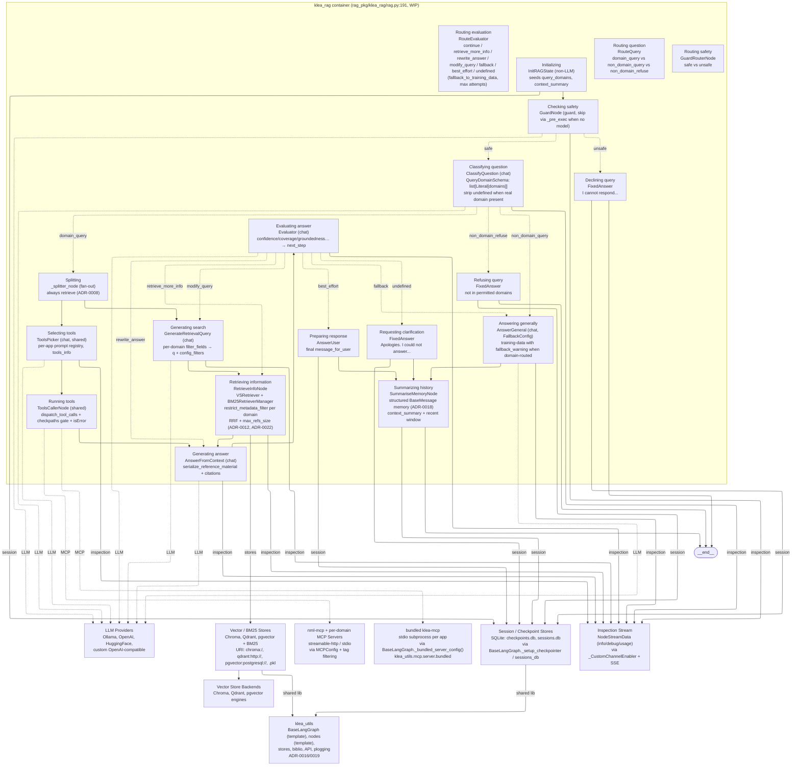
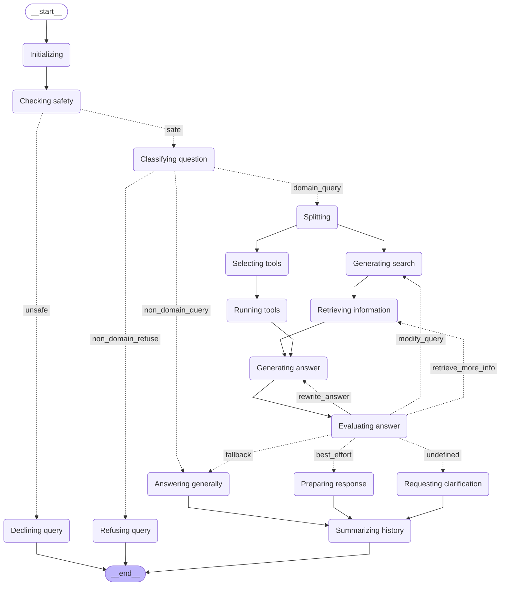

# C4 model: Level 3 -- Component diagram (RAG)

Status: architecture documentation. Reflects the RAG container at the
time of writing. This is the Level 3 view for the ``klea_rag`` container
(``rag_pkg``); the Level 1 system context is in `c4-system-context.md`
and the Level 2 container diagram is in `c4-container.md`.  The agent's
components live in a sibling file to be added when its topology is
accepted (ADR-0025 proposed).

## Scope and intent

A component diagram zooms into one container and shows its *components*
-- the major code units that make up the container -- plus how they
interact with each other and with the containers / external systems from
Level 2.  Per the C4 standard (https://c4model.com/diagrams/component)
components are deployable as part of their container.

**Container in scope:** ``klea_rag`` (the RAG pipeline: ``rag_pkg/klea_rag``).
The diagram shows the RAG graph nodes plus the retrieval, MCP, and
session/checkpoint components that the graph calls.  The graph itself
is implemented over ``klea_utils.graph.base.BaseLangGraph`` (ADR-0016
Template Method) and the nodes share ``klea_utils/nodes/abstract.py``
(ADR-0019) and ``ADR-0013`` inspection stream.

Level 3 for RAG is rendered as a Mermaid ``flowchart`` with
``layout: elk`` (orthogonal routing) for the same reason as Level 2.
The node/edge topology is sourced from the code (``rag_pkg/klea_rag/rag.py:
191`` ``BaseLangGraph._export_graph_png`` also writes the ``.mmd`` via
``graph.get_graph().draw_mermaid()``) and then augmented with the
component-to-container/external edges.

## Component diagram -- RAG container (flowchart, elk + auto-generated core)

The auto-generated LangGraph topology (faithful to code) is embedded as
the core.  The explicit diagram adds the retrieval, MCP, LLM, and store
edges that ``draw_mermaid`` does not see (``VSRetriever``,
``BM25RetrieverManager``, ``MCP Clients``, ``LLM Providers``,
``SQLite``).  Keep the node names in sync with ``rag-lang-graph.mmd``
(``rag_pkg/example-configs/rag-lang-graph.mmd``) -- that file is the
``rag.py:191`` artefact generated alongside ``rag-lang-graph.png``.

*Notes:* Solid `--> ` = normal graph edge (from ``rag.py:191``). Dotted `-. label .->` = conditional ``add_conditional_edges`` (``GuardRouter``, ``RouteQuery``, ``RouteEvaluator``). Double-dash `inspection` / `session` / `MCP` / `LLM` edges are component→container/external interactions that ``draw_mermaid`` omits; they are what make this a C4 Level 3 rather than a bare node graph. Dashed external `bundled` is auto-launched stdio per-app (ADR-0004). The auto-generated ``rag_pkg/example-configs/rag-lang-graph.mmd`` (``config: flowchart: curve: linear`` plus ``classDef first/last``) is the faithful ``draw_mermaid()`` artefact kept alongside the PNG; the node labels above are normalised to it (``Checking safety`` not ``Checking_safety``).

## Auto-generated LangGraph topology (faithful to code, for drift check)

This is the verbatim ``draw_mermaid()`` output from ``rag_pkg/klea_rag/rag.py:191`` (``rag_pkg/example-configs/rag-lang-graph.mmd``, also writes ``.mmd`` alongside ``.png`` via ``BaseLangGraph._export_graph_png``). Keep the explicit diagram above in sync with it; do not edit this block by hand.

## Components

| Component | File | Role | Key contracts |
|-----------|------|------|---------------|
| Initializing | ``klea_rag/nodes/init_rag.py`` | Seeds ``query_domains``, ``context_summary``, ``messages`` | Non-LLM, always runs; no ``_get_info`` |
| Checking safety | ``klea_utils/nodes/guard.py`` | ``GuardNode`` (``guard``, skip via ``_pre_exec`` when no model) | ``guard_decision`` ``safe/unsafe``; fail-open ``_get_default_error_result→safe`` |
| Routing safety | ``klea_utils/nodes/guard_router.py`` | ``GuardRouterNode`` | reads ``guard_decision`` → ``safe/unsafe`` edge |
| Declining / Refusing / Clarification | ``klea_utils/nodes/fixed_answer.py`` ``FixedAnswer`` | Canned refusals | ``_ask_user_for_clarification`` vs ``_refuse_answer`` vs ``Declining`` |
| Classifying question | ``klea_rag/nodes/classify_question.py`` | ``ClassifyQuestion`` (``chat``) | ``QueryDomainSchema: list[Literal[domains]]``; strips ``undefined`` when real domain present (ADR-0011) |
| Routing question | ``klea_rag/nodes/route_query.py`` | ``RouteQuery`` (non-LLM router) | ``domain_query`` / ``non_domain_query`` / ``non_domain_refuse`` |
| Splitting | ``rag.py:127`` ``_splitter_node`` | Fan-out (always retrieve) | ``always retrieve`` (ADR-0008): ``GenerateRetrievalQuery`` + ``ToolsPicker`` in parallel |
| Generating search | ``klea_rag/nodes/generate_retrieval_query.py`` | ``GenerateRetrievalQuery`` (``chat``) | per-domain ``filter_fields`` → ``q`` + ``config_filters`` (ADR-0022) |
| Selecting tools | ``klea_utils/nodes/tools_picker.py`` | ``ToolsPicker`` (shared, ``chat``) | per-app prompt registry, ``tools_info`` from ``BaseLangGraph`` (ADR-0020) |
| Running tools | ``klea_utils/nodes/tools_caller.py`` | ``ToolsCallerNode`` (shared) | ``dispatch_tool_calls`` + ``checkpaths`` gate (ADR-0007) + ``isError`` synthesis (ADR-0003) |
| Retrieving information | ``klea_rag/nodes/retrieve_info.py`` | ``RetrieveInfoNode`` | ``VSRetriever`` + ``BM25RetrieverManager`` per ``BaseKleaRetriever``; ``restrict_metadata_filter`` per domain; ``RRF`` + ``max_refs_size`` (ADR-0012) |
| Generating answer | ``klea_rag/nodes/answer_from_context.py`` | ``AnswerFromContext`` (``chat``) | ``serialize_reference_material`` + citations |
| Evaluating answer | ``klea_rag/nodes/evaluator.py`` | ``Evaluator`` (``chat``) | ``confidence/coverage/groundedness… → next_step`` |
| Routing evaluation | ``klea_rag/nodes/route_evaluator.py`` | ``RouteEvaluator`` | ``fallback_to_training_data`` / ``max attempts`` → ``fallback / best_effort / undefined`` (ADR-0009) |
| Answering generally | ``klea_utils/nodes/answer_general.py`` | ``AnswerGeneral`` (``chat``, ``FallbackConfig``) | ``format_alert(fallback_warning)`` only when domain-routed (ADR-0009) |
| Preparing response | ``klea_rag/nodes/answer_user.py`` | ``AnswerUser`` | ``message_for_user`` |
| Summarizing history | ``klea_utils/nodes/summarise_memory.py`` | ``SummariseMemoryNode`` | ``BaseMessage``-object memory (ADR-0018) + ``context_summary`` |
| Vector / BM25 Stores | ``klea_utils/stores/retrieval/*`` | Stores + ingestion | ``store-create.md`` cache layout; ``.klea-cache/*.pkl`` |
| Bundled / nml-mcp | ``klea_utils/mcp/server/bundled*`` + ``mcp_pkg`` | MCP servers | ``bundled`` stdio per app (ADR-0004), tag-filterable |
| Session / Checkpoint | ``klea_utils/api/sessions_db.py`` + ``graph/base.py`` | ``AsyncSqliteSaver`` | ``checkpoints.db``, ``sessions.db`` (ADR-0023) |

## How the components interact (mirrors Level 2)

* The RAG pipeline is the mature path (``c4-system-context.md:54`` ``Domain-configurable … RAG mature``); the agent's components are a sibling C3 file to be added when ``ADR-0025`` is accepted.
* Every RAG component that needs an LLM (guard, classify, generate-search, picker, answer, evaluate, answer-general) is a ``BaseLLMNode`` (``ADR-0019``) and goes through the shared ``_make_retryer_httpx`` + token-window ladder (``ADR-0017``) and the ``BaseLangGraph`` per-request model switching (``ADR-0014``).
* ``RetrieveInfoNode`` is the composition point for ADR-0012 hybrid (vector+BM25, RRF, ``_source_scores`` debug, ``max_refs_size``) and ADR-0022 filter system (per-domain scoping); ``ToolsCallerNode`` is the composition point for ADR-0007 permissions and ADR-0003 ``isError``.
* Diagrams live in ``devdocs/system/`` as the single source of truth (``devdocs/README.md:27``); ``docs/developer-info.rst`` links to them on GitHub.

## Open items (Level 3+)

* The agent's component diagram (``klea_agent/klea_agent/nodes/`` -- ``goal_setter``, ``planner``, ``explore_planner`` etc.) is ``proposed`` (``ADR-0025``) and not yet accepted.
* The deployment view (local ``uv``/Ollama ``:8005/:8006/:8542`` vs HuggingFace Space ``deployments/huggingface/Dockerfile`` three-service container) is a separate diagram.
