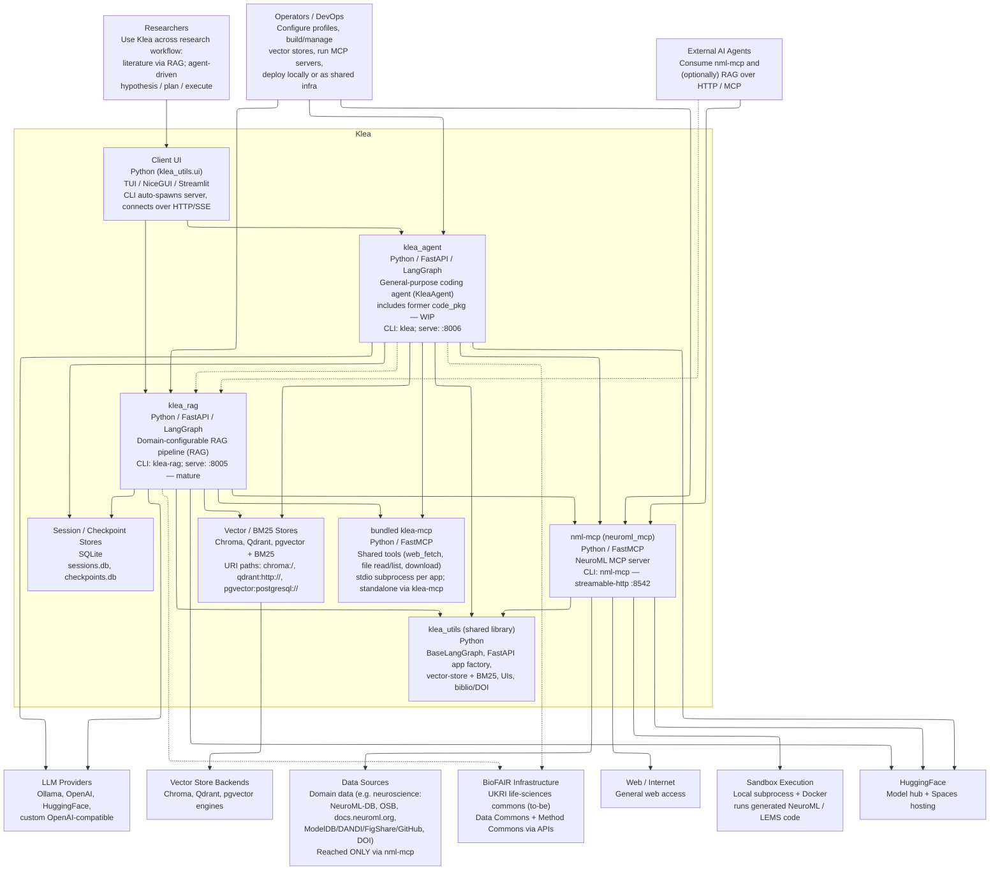

# C4 model: Level 2 -- Container diagram

Status: architecture documentation. Reflects the monorepo at the time of
writing. This is the Level 2 view of the Klea C4 model; the Level 1 system
context is in `c4-system-context.md`, the RAG Level 3 view is in
`c4-component-rag.md`, and the deployment view is in `c4-deployment.md`.
Lower-level code views live in sibling files to be added as needed.

## Scope and intent

A container diagram zooms into the system in scope (Klea) and shows the
*containers* -- the independently deployable applications, services, datastores,
and the shared library -- plus how they interact and how they connect to the
external systems from Level 1.  Per the C4 standard
(https://c4model.com/diagrams/container) containers are things that can be
deployed/run independently (or, for a library, are a separately packaged unit).

**System in scope:** the whole Klea product.  Containers map closely to the
monorepo packages, but note that `klea_utils` is a *library* (not independently
deployed) and the bundled `klea-mcp` server is launched *as a subprocess* of
each app rather than run on its own.

Level 1 is kept as a `C4Context` diagram.  Level 2 is rendered as a Mermaid
`flowchart` with `layout: elk` instead of `C4Container` because Mermaid's C4
has a fixed 2-column grid with straight `Rel` lines that obscure boxes at this
density; `elk` orthogonally routes edges around nodes.  This is a
documentation-notation choice, not a system architecture decision, so no ADR is
created — see the note below.

## Container diagram -- Klea containers (flowchart, elk)

*Notes:* `flowchart` with `layout: elk` is used here because Mermaid's `C4Container` has a fixed 2-column grid and straight `Rel` lines that obscure boxes at this density. `elk` provides orthogonal edge routing around nodes. Level 1 remains `C4Context` (less dense, renders fine). Dashed edges (`-.->`) denote to-be / optional integrations (`BioFAIR`, `agent->rag`, `extagent->rag`). GitHub's Mermaid renderer may fall back from `elk` to `dagre` if `@mermaid-js/layout-elk` is not bundled — the diagram remains readable, just with dagre routing.

## Containers

| Container | Package | Role | Key entry points |
|-----------|---------|------|------------------|
| Client UI | `klea_utils.ui` | TUI / NiceGUI / Streamlit interface; CLI auto-spawns the server and connects over HTTP/SSE | `klea`, `klea-rag` CLIs |
| `klea_agent` | `agent_pkg` | General-purpose coding agent (`KleaAgent` over `BaseLangGraph`); **WIP** | `klea`, `klea-serve` (HTTP `:8006`) |
| `klea_rag` | `rag_pkg` | Domain-configurable RAG pipeline (`RAG` over `BaseLangGraph`); mature path | `klea-rag`, `klea-rag-serve` (HTTP `:8005`) |
| `nml-mcp` | `mcp_pkg` | NeuroML MCP server: model gen, NeuroML-DB/OSB search, sandboxed code exec, web/doc tools | `nml-mcp` (streamable-http `:8542`) |
| bundled `klea-mcp` | `klea_utils.mcp.server.bundled` | Shared tools server (web_fetch, file read/list, download); launched as a stdio subprocess by each app | `klea-mcp` (standalone) |
| `klea_utils` | `utils_pkg` | Shared library: `BaseLangGraph`, FastAPI app factory, vector-store + BM25 managers, UIs, biblio/DOI | (imported by all apps) |
| Vector / BM25 Stores | -- | Retrieval stores (URI-style paths: `chroma:`, `qdrant:`, `pgvector:`, BM25 `.pkl`) | -- |
| Session / Checkpoint Stores | -- | SQLite `sessions.db`, `checkpoints.db` | -- |

## How the containers interact

- Every app (`klea_agent`, `klea_rag`) subclasses `BaseLangGraph`
  (`klea_utils.graph.base`) and is served as a FastAPI app (`klea_utils.api`).
- Each app launches the **bundled `klea-mcp`** server as a **stdio subprocess**
  and connects to it (plus any configured MCP servers) at runtime via the
  `MCPConfig` mechanism.
- All three apps also call the **`nml-mcp`** NeuroML server over HTTP/MCP.
- Researchers reach the apps through the **Client UI** (CLI spawns the server,
  then a TUI/Web UI connects over HTTP/SSE).
- Datastores: apps read/write the **Vector / BM25 Stores** (backed by the
  Chroma/Qdrant/pgvector engines) and persist conversation/checkpoint state in
  **SQLite**.
- `nml-mcp` is the only container that reaches the external **Data Sources**
  (NeuroML-DB, OSB, docs.neuroml.org, ModelDB/DANDI/FigShare/GitHub, DOI
  resolvers) and the **Sandbox** / **Web** systems.

## Open architecture decision (forward reference)

The edge `klea_agent -> klea_rag` ("uses RAG as retrieval backend") is drawn
but its **mechanism is undecided** -- tracked as a future ADR.  Candidate mechanisms are the RAG HTTP API versus
direct vector-store access; note that RAG returns natural-language answers
for humans while the agent needs the retrieved documents.  Until then, the
agent and RAG are wired through shared MCP servers (e.g. both point at
``nml-mcp``) rather than a direct code dependency.  See also the agent
correctness architecture ``ADR-0029`` (``accepted``; supersedes ``ADR-0025``).

## Out of scope (Level 3+)

The internals of the RAG container (``classify_question``,
``generate_retrieval_query``, ``retrieve_info``, ``answer_from_context``,
``evaluator`` etc.) are shown at Level 3 in `c4-component-rag.md`
(auto-generated Mermaid core + ``elk`` augmentation, with drift check
against ``rag_pkg/example-configs/rag-lang-graph.mmd``).  The agent's graph
nodes (``planner``, ``explore_planner``, ``goal_setter``,
``evaluator``, ``tools_router``) will be shown at Level 3 when the
correctness architecture (``ADR-0029``, ``accepted``; superseding ``ADR-0025``) is implemented.  The ``nml-mcp``
tool/sandbox layout and the ``klea_utils`` API/stores internals are
future code-level views.  The deployment view (local vs container
platform with HuggingFace Spaces as a nested node) is ``c4-deployment.md``.
