# C4 model: Deployment diagram

Status: architecture documentation. Reflects the deployed Klea
containers at the time of writing. This is the deployment view of the
Klea C4 model; the Level 1 system context is in `c4-system-context.md`,
Level 2 containers in `c4-container.md`, and Level 3 RAG components in
`c4-component-rag.md`.  The agent's components are still `proposed`
(ADR-0025) and the deployment view for the agent is the same topology
with the agent container added.

## Scope and intent

A deployment diagram shows where the C4 *containers* run: the
*deployment nodes* (hardware, VMs, containers) and how the containers
are mapped onto them.  Per the C4 standard
(https://c4model.com/diagrams/deployment) a deployment node is a
machine/container/platform.

**System in scope:** the same Klea product as Level 1
(``klea_utils`` + ``klea_rag`` + ``klea_agent`` (WIP) + ``nml-mcp``),
but mapped onto two deployment variants plus the offline build node:

* *Build-time* on the developer workstation (``klea-stores-create``
  writes ``chroma.sqlite3`` / ``.pkl`` corpora to ``.klea-cache/``).
* *Run-time* on a local machine (direct ``uv`` install or ``docker run``
  of the ``deployments/huggingface/Dockerfile`` image).
* *Run-time* on a container platform (Docker) -- HuggingFace Spaces is
  the current example (``sdk: docker``, submodule
  ``deployments/huggingface/`` logical monorepo vs HF Space repo),
  institutional platforms (BioFAIR) are the planned generalisation.

The same ``Klea`` containers (``rag``, ``nml-mcp``, ``bundled
klea-mcp``, ``Vector/BM25 Stores``, ``Session/Checkpoint``) appear in
both run-time nodes; they differ only in ``KLEA_*_ENV_FILE`` /
``--profile`` and where the LLM / vector-store backends live
(``ollama:`` locally vs HuggingFace Inference ``huggingface:`` /
``custom:`` per ADR-0014).

This is rendered as Mermaid ``C4Deployment`` (Docker is the general
container platform; HuggingFace Spaces is a deployment node *inside* it,
so the same ``Dockerfile`` is not HF-only).  The monorepo-vs-submodule
distinction is mentioned only inside the ``HuggingFace Spaces``
deployment node.

## Deployment diagram

```mermaid
---
config:
  c4:
    wrap: true
---
C4Deployment
    title Deployment diagram for Klea -- build-time vs local vs container platform (Docker)

    Deployment_Node(devWorkstation, "Developer Workstation (Build-time)", "Where vector stores are built -- not deployed") {
        Container(storeCreate, "klea-stores-create", "Python / Typer + Docling + httpx lifespan", "Chunk / store / build -- writes vector-stores/** and BM25 corpora to .klea-cache/")
        ContainerDb(cache, "Build caches", "File system: .klea-cache/", ".pkl per file (atomic), doi-cache.json (batched, human-readable), metadata-map.template.json")
        ContainerDb(storesBuilt, "Built stores", "Chroma / BM25 corpora", "chroma.sqlite3 (single file, many collections) + <collection>.pkl + doi-cache.json")
        Rel(storeCreate, cache, "Writes/reads", "atomic pickle + batch")
        Rel(storeCreate, storesBuilt, "Writes", "chroma:/path, pickle dump per batch")
    }

    Deployment_Node(localMachine, "Local Machine (Direct or Docker)", "Direct uv install or docker run of the same image") {
        Container(ragLocal, "klea_rag", "Python / FastAPI + LangGraph (RAG) -- BaseLangGraph (ADR-0016)", "Serves: klea-rag, klea-rag-serve :8005, klea-rag web :7860")
        ContainerDb(vstoresLocal, "Vector / BM25 Stores", "Chroma file / Qdrant / pgvector + BM25 .pkl", "URI: chroma:/path, qdrant:http://, pgvector:postgresql://, .pkl; resolved via --profile / platformdirs")
        ContainerDb(sqliteLocal, "Session / Checkpoint Stores", "SQLite", "sessions.db, checkpoints.db via AsyncSqliteSaver")
        Container(bundledLocal, "bundled klea-mcp", "Python / FastMCP stdio per app", "Via BaseLangGraph._bundled_server_config()<br/>auto-launched, tag-filterable")
        Container(nmlLocal, "nml-mcp", "Python / FastMCP streamable-http :8542", "NeuroML tool server")
        Rel(ragLocal, vstoresLocal, "Reads/writes", "RetrieverConfig per domain")
        Rel(ragLocal, sqliteLocal, "Persists", "sessions + checkpoints")
        Rel(ragLocal, bundledLocal, "Launches", "stdio")
        Rel(ragLocal, nmlLocal, "Calls", "streamable-http / MCP")
        Rel(vstoresLocal, cache, "Built from", "build-time")
    }

    Deployment_Node(containerPlatform, "Container Platform (Docker)", "Generic Docker -- e.g. institutional, local, or HuggingFace") {
        Deployment_Node(hfSpaces, "HuggingFace Spaces", "sdk: docker\nMonorepo deployments/huggingface/ submodule (logical) vs HF Space repo\n.gitattributes vector-stores/** filter=lfs/xet; README.md suggested_hardware: cpu-basic") {
            Container(ragHf, "klea_rag", "Python / FastAPI + LangGraph (same image as local)", "Dockerfile fedora:44 + uv + HF Spaces sdk: docker\nRuns: nml-mcp & , klea-rag-serve :8005 & , klea-rag web :7860 (foreground)")
            ContainerDb(vstoresHf, "Vector / BM25 Stores (baked)", "Chroma / BM25 corpora baked into image", "chroma:/app/vector-stores/** via git lfs/xet")
            ContainerDb(sqliteHf, "Session / Checkpoint Stores", "SQLite", "Same as local, ephemeral per Space")
            Container(bundledHf, "bundled klea-mcp", "Python / FastMCP stdio per app", "Same as local")
            Container(nmlHf, "nml-mcp", "Python / FastMCP", "Same as local, inside same container")
            Rel(ragHf, vstoresHf, "Reads", "baked")
            Rel(ragHf, sqliteHf, "Persists", "ephemeral")
            Rel(ragHf, bundledHf, "Launches", "stdio")
            Rel(ragHf, nmlHf, "Calls", "in-container")
            Rel(vstoresHf, cache, "Baked from", "git lfs/xet")
        }
    }

    System_Ext(llm, "LLM Providers", "Ollama, OpenAI, HuggingFace, custom OpenAI-compatible")
    System_Ext(quickGen, "HuggingFace Inference API", "For HF-hosted models")
    System_Ext(vbackends, "Vector Store Backends", "Chroma, Qdrant, pgvector engines")
    System_Ext(hfHub, "HuggingFace Hub", "Model hub + Spaces hosting")
    System_Ext(datasources, "Data Sources", "NeuroML-DB, OSB, docs.neuroml.org, Data Commons (to-be) via nml-mcp")

    Rel(ragLocal, llm, "Calls", "ollama: / huggingface: / custom: (ADR-0014 runtime switching)")
    Rel(ragHf, llm, "Calls", "huggingface: / custom: (same)")
    Rel(ragHf, quickGen, "Calls", "HuggingFace Inference")
    Rel(vstoresLocal, vbackends, "Backed by", "embeds/queries")
    Rel(vstoresHf, vbackends, "Backed by", "same")
    Rel(nmlLocal, datasources, "Fetches", "via nml-mcp")
    Rel(nmlHf, datasources, "Fetches", "same")
    Rel(ragLocal, hfHub, "Pulls models", "HF_TOKEN")
    Rel(ragHf, hfHub, "Pulls models + deploys as Space", "same")

    UpdateLayoutConfig($c4ShapeInRow="3", $c4BoundaryInRow="1")
```

*Notes:* ``Deployment_Node(devWorkstation)`` is **build-time** (not
run-time) -- it produces the ``vector-stores/**`` artefacts that are
baked into the container image.  ``Deployment_Node(localMachine)`` covers
both direct ``uv`` installs and ``docker run -p 7860:7860`` of the
``deployments/huggingface/Dockerfile`` locally.  ``Deployment_Node(
containerPlatform)`` is the general Docker platform; ``Deployment_Node(
hfSpaces)`` inside it is the HuggingFace Spaces *instance* of that
platform -- the submodule (``deployments/huggingface/`` logical monorepo
vs HF Space repo) and the ``.gitattributes`` ``vector-stores/**
filter=lfs/xet`` plus ``README.md`` ``suggested_hardware: cpu-basic``
are mentioned only inside the ``hfSpaces`` node.  Solid ``Rel`` inside
a run-time node vs dotted external ``System_Ext`` edges mirror Level 1.

## Deployment nodes & containers

| Deployment node | Hosts | Containers / data | Notes |
|------------------|-------|------------------|-------|
| Developer Workstation (Build-time) | Author's laptop / CI | ``klea-stores-create`` (Typer), ``.klea-cache/`` (``*.pkl``/``*.pkl.corrupt``/``doi-cache.json``/``metadata-map.template.json``), built ``chroma.sqlite3`` + BM25 ``.pkl`` | ``chunk_all`` worker-isolated (ADR-0001) + ``_save_to_cache`` atomic / ``_prune_cache`` (demoted 0022) + OCR ``pre-check`` / ``store-lint``/``map-lint`` (demoted 0023-0024) + ``char-budget`` ``max_refs_size`` (demoted 0027) |
| Local Machine (Direct or Docker) | ``uv pip install`` or ``docker run`` | ``klea_rag`` (``:8005`` + ``:7860`` web), ``bundled klea-mcp`` stdio, ``nml-mcp`` ``:8542``, ``Vector/BM25 Stores`` (file vs Qdrant/pgvector service per URI), ``Session/Checkpoint`` SQLite, plus ``agent`` ``:8006`` when ``ADR-0025`` accepted | ``KLEA_*_ENV_FILE`` / ``--profile`` (``platformdirs`` ``~/.config/klea-rag/``, ``XDG_CONFIG_HOME`` per ADR-0015; ``KLEA_*_GUARD_MODEL`` empty skips guard per ADR-0010); per-request model switching per ADR-0014 |
| Container Platform (Docker) -- generic | Any Docker host | Same ``klea_rag``/``nml-mcp``/``bundled``/``SQLite`` containers as Local | The ``deployments/huggingface/Dockerfile`` image is not HF-only |
| -- HuggingFace Spaces (inside Container Platform) | HF Spaces ``sdk: docker`` | Same containers, plus baked ``vector-stores/**`` (``chroma:/app/vector-stores/**``) | Logical monorepo ``deployments/huggingface/`` submodule vs HF Space repo; ``.gitattributes`` ``vector-stores/** filter=lfs/xet``; ``README.md`` ``suggested_hardware: cpu-basic`` |

## How the deployments relate (mirrors Level 2)

* The three Klea apps (``klea_rag`` mature, ``klea_agent`` WIP, ``nml-mcp``
  ``:8542``) are the same containers in both run-time nodes; they differ
  only in ``KLEA_*_ENV_FILE``/``--profile`` and where the LLM /
  vector-store backends live (Ollama locally vs HuggingFace Inference
  ``huggingface:`` / ``custom:`` per ``docs/install.rst:161``).
* Tool servers: the ``Client UI`` auto-spawns them and connects over
  HTTP/SSE/MCP (see Level 2 ``Client UI -> agent/rag -> nml-mcp``);
  external ``MCP Clients`` consume ``nml-mcp`` directly over HTTP/MCP.
* ``.agents/`` session logs + ``devdocs/`` remain the developer view and
  are not deployed.

## Open items

* The agent's deployment (``klea_agent :8006``) is the same topology with
  the agent container added; it will be drawn when ``ADR-0025`` is
  accepted.
* BioFAIR institutional deployment (``Data Commons``/``Method Commons``
  via APIs) is planned (``c4-system-context.md:118``).
