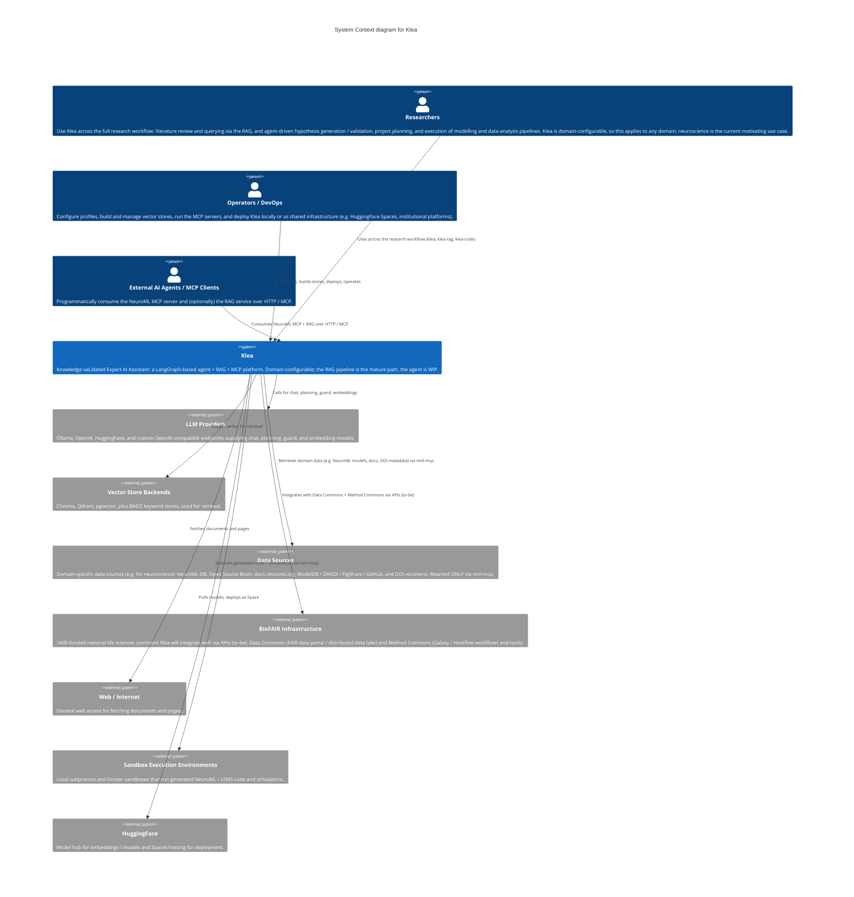

# C4 model: Level 1 -- System Context diagram

Status: architecture documentation. Reflects the monorepo at the time of
writing. This is the top of a C4 model of Klea; lower levels live in sibling
files (`c4-container.md`, etc., to be added).

## Scope and intent

A system context diagram is the zoomed-out view: the software system in scope
drawn as a single box in the centre, surrounded by the people who use it and
the other software systems it interacts with.  Per the C4 standard
(https://c4model.com/diagrams/system-context) the focus is on people and
software systems, not technologies, protocols, or low-level detail.  It is the
sort of diagram that is meaningful to both technical and non-technical readers.

**System in scope:** the whole Klea product (the entire monorepo: `utils_pkg`,
`agent_pkg`, `rag_pkg`, `mcp_pkg`, `code_pkg`).  The individual packages are
*containers* and are decomposed in the Level 2 container diagram, not here.

### Domain note (important)

Klea is a general-purpose platform; neuroscience is the motivating use case,
but apart from the `neuroml_mcp` server (`nml-mcp`) nothing in Klea is
neuroscience-specific:

- `klea_rag` (the RAG pipeline) and `klea_agent` (the agent) are
  domain-configurable: they work for any domain.  A deployment points them at
  whatever vector stores, LLM providers, and MCP servers its domain needs.
- `nml-mcp` is the neuroscience-specific part: it contains the NeuroML
  tooling and is the only component that talks to the neuroscience data
  sources listed below.
- The RAG pipeline is the currently mature, primary use case.  The agent
  (`klea_agent`) is work-in-progress; development has so far focused on RAG.

Although Klea is being validated in the neuroscience domain (via `nml-mcp` and
the curated NeuroML vector stores), it is developed as a general-purpose RAG +
agentic assistant and is not tied to any single domain.

## System Context diagram

## System in scope

**Klea** -- "Knowledge vaLidated Expert AI Assistant".  A LangGraph-based
platform that combines a general-purpose agent, a retrieval-augmented
generation (RAG) pipeline, and Model Context Protocol (MCP) tooling.  It is
domain-configurable: the same agent and RAG machinery serve any domain when
pointed at the right vector stores, LLM providers, and MCP servers.  The
neuroscience flavour comes from the `nml-mcp` server and the curated
NeuroML vector stores it is wired to; the agent and RAG code themselves carry
no neuroscience assumptions.

## Actors (people)

| Actor | Role | How they use Klea |
|-------|------|-------------------|
| Researchers | End users running research workflows | Use `klea` / `klea-rag` / `klea-code` (CLI, TUI, or Web UI) across the full workflow: literature review and querying via the RAG, and agent-driven hypothesis generation / validation, project planning, and execution of modelling and data-analysis pipelines.  Klea is domain-configurable (neuroscience is the current motivating use case). |
| Operators / DevOps | Operate, deploy, and provision | Configure profiles, build/manage vector stores (`klea-stores-create`), run the MCP servers, and deploy Klea locally or as shared infrastructure (e.g. HuggingFace Spaces, institutional platforms). |
| External AI Agents / MCP Clients | Automated consumers | Connect over HTTP / MCP to `nml-mcp` and (optionally) the RAG service as a backend. |

## External software systems

| System | Provides | How Klea connects (high level) |
|--------|----------|--------------------------------|
| LLM Providers | Chat, planning, guard, and embedding models (Ollama, OpenAI, HuggingFace, custom OpenAI-compatible) | Called by the agent and RAG apps for inference and embeddings. |
| Vector Store Backends | Retrieval stores (Chroma, Qdrant, pgvector) and BM25 keyword stores | Read/written by the RAG and agent apps for retrieval. |
| Data Sources | Domain-specific data (e.g. for neuroscience: NeuroML models, docs, bibliographic metadata from NeuroML-DB, OSB, docs.neuroml.org, ModelDB/DANDI/FigShare/GitHub, DOI resolvers) | Reached ONLY through the neuroscience-specific `nml-mcp` server. |
| BioFAIR Infrastructure | UKRI-funded national life-sciences commons (to-be): Data Commons (FAIR data portal / distributed data lake) and Method Commons (Galaxy / Nextflow workflows and tools) | Klea will integrate with them via their APIs when available. |
| Web / Internet | Arbitrary documents and pages | Fetched by the bundled `web_fetch` tool and the `nml-mcp` web tools. |
| Sandbox Execution Environments | Local subprocess and Docker sandboxes | Run generated NeuroML / LEMS code via `nml-mcp`. |
| HuggingFace | Model hub and Spaces hosting | Supplies embedding/models; hosts the deployed Space. |

## Deployment

Klea runs in two modes.  **Locally**, a developer installs the packages (uv /
venv) and runs the apps against a local LLM backend such as Ollama.  **On
shared infrastructure**, the apps are deployed as HuggingFace Spaces; the demo
RAGs are already hosted there, with curated NeuroML vector stores baked into
the image.  Both modes are the same FastAPI + uvicorn services, differing only
in configuration and where the model / store backends live.  Institutional and
national shared infrastructure (e.g. BioFAIR) is a planned integration target.

## Open architecture decision (forward reference)

How the agent consumes the RAG's curated information is an open decision and is
out of scope for this diagram (both are inside the Klea boundary).  Candidate
mechanisms are the RAG HTTP API versus direct vector-store access, noting that
RAG returns natural-language answers for humans while the agent needs the
retrieved documents.  This will be recorded as `adr/0003-agent-rag-integration.md`
and the relationship is drawn at Level 2.

## Out of scope (Level 2+)

The internal packages -- `klea_agent`, `klea_rag`, `neuroml_mcp` (`nml-mcp`),
`klea_code`, and `klea_utils` (shared library: `BaseLangGraph`, API factory,
stores, bundled MCP server) -- plus the FastAPI serving layer, the TUI / Web
UIs, the bundled `klea-mcp` stdio server, and the SQLite session / checkpoint
stores are all *inside* the Klea boundary.  They are containers and are shown
in the Level 2 container diagram (`c4-container.md`).
