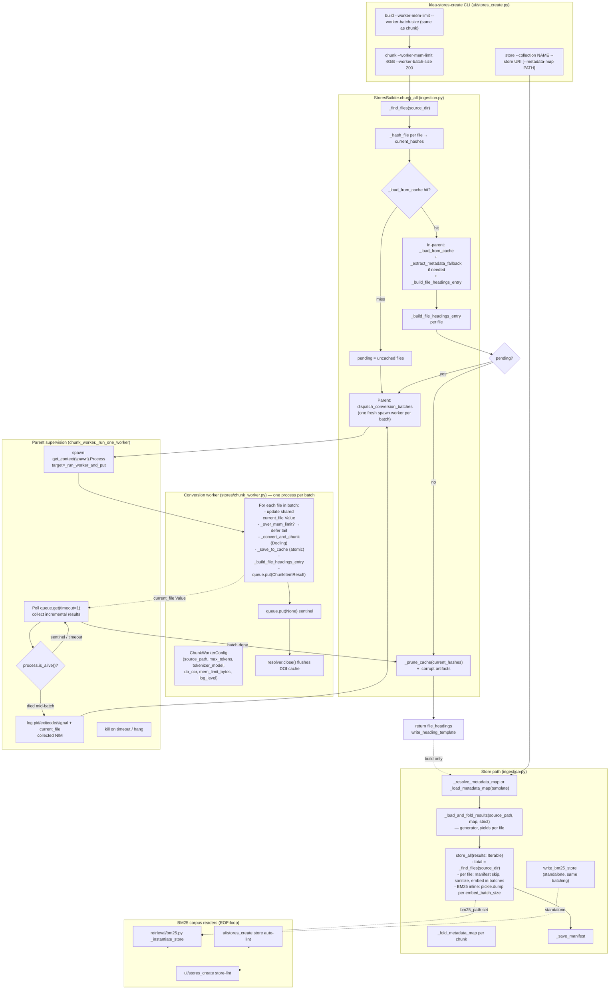

# Store creation pipeline: chunk, store, and build

Status: architecture note.  Reflects the post-chunk-worker state
(`StoresBuilder.chunk_all` always worker-isolated, `build` composes
chunk + streaming store).

## Overview

`klea-stores-create` turns a directory of source documents (PDF, Markdown,
etc.) into a vector store and a BM25 keyword store.  Three commands share
one cache (`<source>/.klea-cache/`):

* `chunk` -- convert + chunk + cache + write `metadata-map.template.json`
* `store` -- load cached chunks, fold a metadata map, embed, write to stores
* `build` -- one-shot `chunk` (cache-only) + `store` (streaming)

Large corpora (thousands of PDFs) must stay memory-bounded.  Docling leaks
memory per conversion that cannot be freed in-process
(docling-project/docling#2788), so `chunk` (and `build`'s chunk phase)
isolates conversion in short-lived subprocess workers.  `store` (and
`build`'s store phase) streams cached chunks one file at a time.

```
Source directory  ─┐
                   │
            .klea-cache/  ◄─── shared by all three commands
            ├── *.pkl              per-file chunk cache (atomic write)
            ├── *.pkl.corrupt      moved-aside unreadable entries
            ├── doi-cache.json     DOI resolution cache (atomic + batched)
            ├── metadata-map.template.json
            └── <collection>.manifest.json
```

## Flowchart



## Chunk in detail

1. **Find + hash** — `_find_files` lists ingestible files (skips `.klea-cache/`,
   the store dir, the metadata-map file).  Each file is hashed with
   `xxhash` for the cache key; every hash goes into `current_hashes`
   (whether conversion succeeds or not) so `_prune_cache` can mirror the
   source directory.

2. **Phase A — cache hits in the parent** — the parent stays lean (it
   never loads Docling's models).  For each file whose `.pkl` exists:
   `pickle.load` is guarded — `EOFError`/`UnpicklingError`/etc. moves the
   file aside as `*.pkl.corrupt` and the file becomes uncached.  A legacy
   entry with no persisted extraction runs the text-only fallback
   (`_extract_metadata_fallback`).  `_build_file_headings_entry` builds
   `{"DEFAULT": {extracted}, "heading > heading": {}}`.

3. **Phase B — conversion workers** — `pending` uncached files are
   handed to `dispatch_conversion_batches` (`chunk_worker.py`).  One fresh
   `spawn` worker per `worker_batch_size` (default 200) files.  The parent
   logs `Processing files X-Y/N (batch #K)`.

   Each worker (`convert_batch_worker`):
   * rebuilds its own `StoresBuilder` + calls `_ensure_tokenizer` + makes
     its own `DoiResolver` (fresh HTTP client, loads `doi-cache.json` at
     start)
   * before each file checks `_current_rss_bytes` (`/proc/self/status`
     VmRSS) against `mem_limit_bytes` (`--worker-mem-limit` GiB, default
     4 — includes the ~1-1.5 GiB models).  Over the cap → remaining files
     returned as `deferred` for a fresh worker.  On non-Linux the check
     is `None` and only `batch_size` bounds the worker.
   * updates a shared `current_file` `Value` so the parent can name the
     file being processed when the worker dies
   * `queue.put` per-file `ChunkItemResult` (`ok`/`zero_chunks`/`failed`)
     and a final `None` sentinel; `resolver.close()` flushes batched DOI
     saves.

4. **Parent supervision** — `_run_one_worker` polls `queue.get(timeout=1)`,
   collecting incrementally and logging `Completed {file} (N/M in batch)`.
   On `Empty` + `not is_alive()` it logs `pid`/`exitcode`/`signal`,
   the file from `current_file` and `collected N/M`; deferred tails are
   prepended to `pending` for a fresh worker.  Hung workers are `kill()`ed
   after `4h`.

5. **Prune + return** — `_prune_cache` removes stale `*.pkl` and healed
   `*.pkl.corrupt` artifacts; `file_headings` is returned (only headings —
   chunks live on disk, read back by `store`).

`--worker-mem-limit` and `--worker-batch-size` — a worker stops at
whichever comes first.  Fully-cached re-runs have empty `pending` and spawn
zero workers.

## Store in detail

`store` is cache-only: every source file must have a `.pkl`.

* `_load_and_fold_results(..., strict=True)` (default) is a **generator**
  — it yields `(file_hash, docs, file_path)` per file, folding the map
  via `_fold_metadata_map` (and warning when no chunk resolves metadata).
  `strict=True` raises on a file with no cache entry; `build` passes
  `strict=False` to skip files whose conversion failed so the rest is
  stored.
* `store_all(results: Iterable, ..., bm25_path)` derives `total` from
  `_find_files(source_dir)` (generators have no `len`) and iterates once.
  Incremental manifest: unchanged files skipped, changed files' old IDs
  deleted, new files added.  Sanitised copies are embedded in
  `embed_batch_size` chunks; empty-list metadata dropped only on the copies.
* **BM25** — when `bm25_path` is set, `store_all` writes inline: one
  `pickle.dump(batch)` per `embed_batch_size` chunks, so the corpus
  never holds more than a batch in memory.  The standalone
  `write_bm25_store` helper does the same.  Readers loop `pickle.load`
  until `EOFError` — batched corpora and legacy single-list corpora are
  both loadable (`retrieval/bm25.py:101`, `ui/stores_create.py:473`,
  `ui/stores_create.py:558`).

## Build

`build` (`ingestion.py:163`, CLI `ui/stores_create.py:619`) composes the
two bounded paths:

1. `chunk_all` in worker-isolated, cache-only mode (no map, no collected
   results) → `file_headings`.
2. `write_heading_template` (or resolve the explicit map) → `metadata_map`.
3. `_load_and_fold_results(source_path, map, strict=False)` → `store_all`.

No phase holds the whole corpus; `build --worker-mem-limit`/`--worker-batch-size`
are the same flags as `chunk`.

## Caches

* **`.klea-cache/*.pkl`** — `(docs, extracted)` tuples.  `_save_to_cache`
  writes atomically (`NamedTemporaryFile` + `os.replace`); stray `.tmp`
  cleaned in `finally`.  Unreadable entries are quarantined as
  `*.pkl.corrupt` (preserving bytes) and pruned with orphaned entries by
  `_prune_cache(current_hashes)` at the end of every `chunk_all` call,
  making ingest resumable and self-healing after OOM-kills or `Ctrl-C`.
  See ADR-0001 for worker isolation; the cache hygiene is the
  resumable complement.
* **`doi-cache.json`** — `{doi: BiblioRecord}` dict, loaded at resolver
  init.  Writes are atomic (same temp+replace) and batched: at most once
  per 25 new resolutions, plus a flush on `close()`.  Workers each load
  the current file at start and flush on exit; phases are sequential so
  appends are preserved.  Human-readable; tolerates loss (`{}` on corrupt).

## Operational notes (demoted from ADRs)

The following are features that do not warrant separate ADRs but are
part of the ingest contract; they live here to keep ADR count focused
on structural decisions.

* **OCR-aware pre-check (was 0023).** `klea-stores-create pre-check
  <source>` classifies PDFs by whether they have a text layer (via
  `pypdfium2` char count) rather than by publication year, reporting
  `needs OCR` vs `text-based`.  With `--organise` it copies files
  into `ocr/` and `no-ocr/` subdirectories (source dir untouched)
  and prints a two-pass `chunk` workflow.  The worker respects the
  per-file `do_ocr` flag (`ChunkWorkerConfig.do_ocr`) and the
  `DOCLING_DEVICE=cpu` / `DOCLING_NUM_THREADS` env tuning for
  CUDA < 7.0 GPUs.

* **Store/map linters (was 0024).** `klea-stores-create store-lint
  <corpus.pkl>` runs LLM-free, deterministic checks over a written
  BM25 corpus (summary, near-empty text from conversion/OCR miss,
  missing bibliographic metadata, `file_name` structural checks) and
  prints evenly-spaced contiguous sample windows.  It is also printed
  automatically when a BM25 corpus is written.  `klea-stores-create
  map-lint <dir>` runs the same style checks over the metadata map
  (missing `DEFAULT`, suspicious titles/DOIs, year/filename
  mismatches, `venue` staleness, excess `url*` keys, heading-keyed
  vs filename-keyed map detection) and exits non-zero for fatal
  conditions.  Both are source-document-aware.

* **Char-budgeted reference material (was 0027).** `max_refs_size`
  (default 20000 chars in `GeneralConfig`) caps the *serialized* reference
  material fed to the answer LLM, not the number of retrieved docs.
  `RetrieveInfoNode` first fetches per-store `k`/`k_max`/`k_inc`
  candidates (RRF-merged per ADR-0012), then
  `truncate_reference_material` applies the single global char budget
  in RRF order.  This separates *fetch depth* (`k`) from *LLM context*
  cost.

* **Robust structured-output enforcement (was 0031).** The node
  template (ADR-0019) enforces `output_schema` both in the LangChain
  `invoke` call *and* as an injected schema block in the system
  prompt (recency: schema last, closest to the human query) so models
  that ignore `invoke`-time schemas still conform.  See
  `docs/concepts/mcp.rst` docstring-first convention and
  `klea_utils/nodes/base.py:722` for the prompt placement; the
  `griffe` `Args:` parsing → tool schema remains the single source.

## References

* `utils_pkg/klea_utils/stores/ingestion.py` — `StoresBuilder`
* `utils_pkg/klea_utils/stores/chunk_worker.py` — workers
* `utils_pkg/klea_utils/biblio/doi.py` — `DoiResolver`
* `utils_pkg/klea_utils/ui/stores_create.py` — `chunk`/`store`/`build`
* ADR: `../adr/chunk-workers.md`
