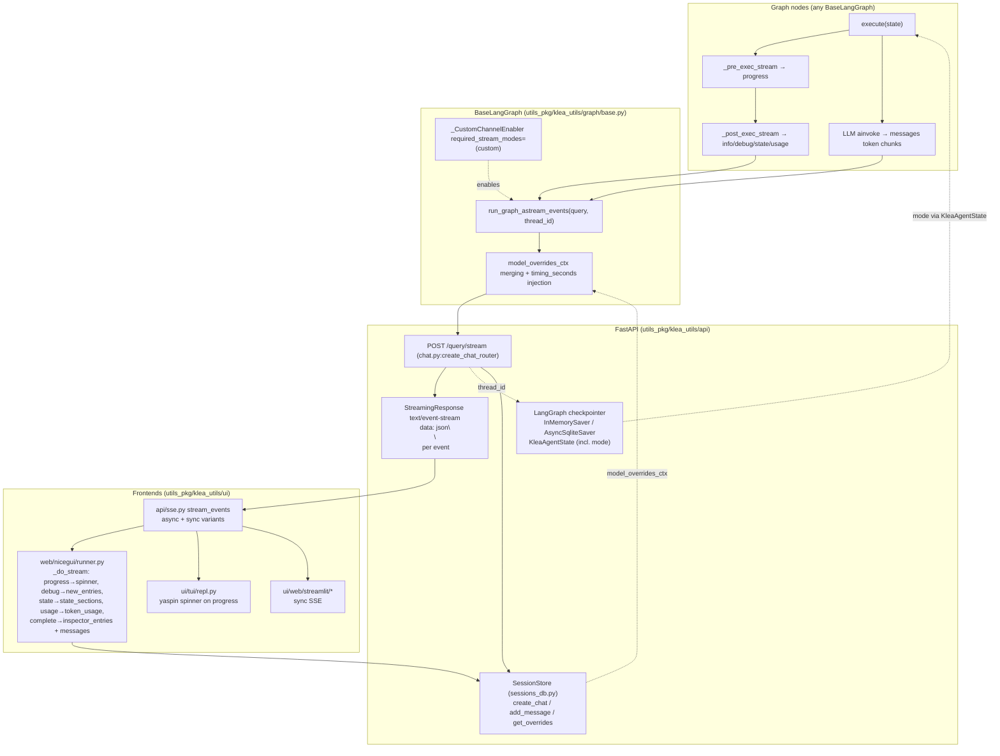
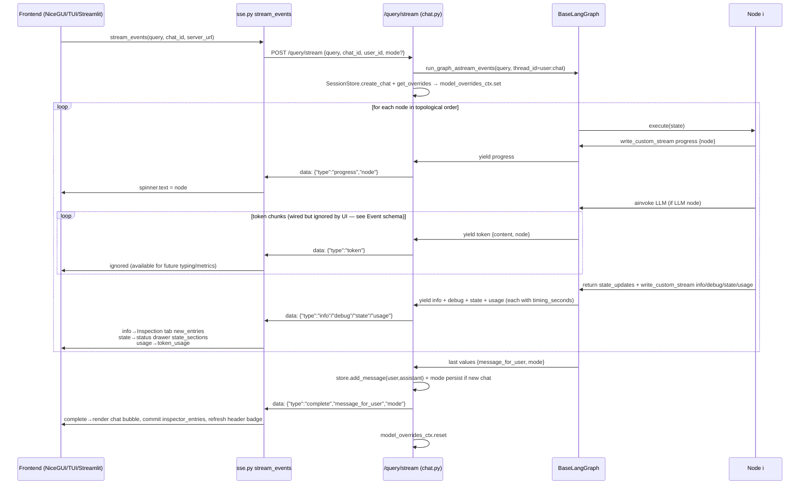

# Streaming from graph nodes to API to frontend

Status: framework contract. Reflects `klea_utils` streaming as implemented in
`klea_utils/nodes/abstract.py` (ADR-0013 inspection, ADR-0019 shared nodes),
`klea_utils/graph/base.py` (ADR-0016 BaseLangGraph, ADR-0014 model switching,
ADR-0017 retry), and `klea_utils/api` + `klea_utils/ui`.

## Overview

Any `BaseLangGraph` (`KleaAgent`, `RAG`) streams node execution to the
frontend in real time. Nodes write structured events on the graph's live event
stream; the API re-emits them as Server-Sent Events; UIs consume the SSE
stream incrementally and route each event type to its pane/tab. The contract is
graph-agnostic: adding a field (e.g. `KleaAgentState.mode`) only adds a key to
`NodeStreamData.details`/`complete` -- no new channel is needed.

```
Graph nodes  -->  BaseLangGraph event stream  -->  FastAPI /query/stream SSE  -->  SSE client  -->  NiceGUI / TUI / Streamlit
```

The graph's checkpoint and the API's `SessionStore` are orthogonal:
the checkpoint persists `KleaAgentState` (including `mode`) for resumption;
the session store persists `messages` and per-chat model overrides.

## Participants and code loci

| Participant | Package/file | Role |
|-------------|--------------|------|
| `AbstractLangGraphNode` / `AbstractLLMNode` | `utils_pkg/klea_utils/nodes/abstract.py` `NodeStreamData`, `NodeStreamEvent`, `_CustomChannelEnabler` | Defines `write_custom_stream` + template `_pre_exec_stream` / `_post_exec_stream` + `info`/`debug`/`state`/`usage` contracts. |
| `BaseLLMNode` | `utils_pkg/klea_utils/nodes/base.py` | LLM prompt/file, `model_overrides_ctx`, token-window adapt, structured output fallback. |
| `BaseLangGraph` | `utils_pkg/klea_utils/graph/base.py` `run_graph_astream_events`, `model_overrides_ctx` | Compiles graph, enables `custom` channel via `StreamTransformer`, merges per-chat model overrides into `RunnableConfig`. |
| `make_app` | `utils_pkg/klea_utils/api/app.py` | Creates `app.state.graph` + `app.state.chat_sessions` `SessionStore`. |
| `create_chat_router` | `utils_pkg/klea_utils/api/chat.py` `/query/stream` `StreamingResponse(text/event-stream)` | Iterates `graph.run_graph_astream_events`, yields `data: {json}\n\n` per event. |
| `SessionStore` | `utils_pkg/klea_utils/api/sessions_db.py` | `chat_sessions` (`overrides` JSON) + `messages`; `get_overrides`/`set_override`. |
| `stream_events` | `utils_pkg/klea_utils/api/sse.py` | Async (NiceGUI/TUI) + sync (Streamlit) SSE client; parses `data:` lines into events. |
| NiceGUI frontend | `utils_pkg/klea_utils/ui/web/nicegui/runner.py` `setup_layout`, `_do_stream` | Chat area, Inspection tab, status drawer, model pill, token usage. |
| TUI | `utils_pkg/klea_utils/ui/tui/repl.py` | `yaspin` spinner for `progress`, final answer print. |
| Streamlit | `utils_pkg/klea_utils/ui/web/streamlit/*` | Sync SSE variant. |

Related: ADR-0013 inspection, ADR-0019 shared abstract nodes, ADR-0016 BaseLangGraph
template, ADR-0014 runtime model switching, ADR-0017 LLM retry.

## Channels

| Channel | LangGraph stream | Enabling mechanism | Content |
|---------|----------------|--------------------|---------|
| `custom` | `write_custom_stream` via `get_stream_writer()` | `StreamTransformer` `required_stream_modes = ("custom",)` (`_CustomChannelEnabler` in `graph/base.py`) | `progress` (entering node), `info`, `debug`, `state`, `usage` (LLM token counts). Each is a `NodeStreamEvent(type, node, data: NodeStreamData)`. |
| `messages` | LangChain `AIMessage` chunks | Built-in LangGraph `messages` channel | Live LLM `token` chunks (`content-block-delta.text`). |
| `values` | `graph.get_state` | Built-in | Final dict with `message_for_user` etc., surfaced as `complete`. |

`progress`/`info`/`debug`/`state`/`usage` arrive as `method=="custom"` events;
`token` as `method=="messages"` `content-block-delta`; `complete` is synthesized
from the last `values` event after the stream ends.

## Event schema

Every `custom` event is JSON `{"type", "node", "data": NodeStreamData}`:

```python
class NodeStreamData(BaseModel):
    heading: str  # e.g. "Goal Definition", "Plan"
    summary: str  # one-line human summary, always rendered
    details: dict  # collapsible JSON, e.g. {"goal", "mode", "step_count"}
    display: str  # markdown for status pane (via `state` event)
```

| `type` | `data` source | Frontend target | Timing |
|--------|---------------|-----------------|--------|
| `progress` | `AbstractLangGraphNode._pre_exec_stream()` or `write_custom_stream({"type":"progress"})` at top of `execute` | Status spinner label, header timing | Start of node |
| `info` | `_get_info()` via `_post_exec_stream()` | Inspection tab card (`info` entry). Currently includes `mode` in `details` for every `agent_pkg` node (`init_graph`, `goal_setter`, `planner`/`explore_planner`, `evaluator`, `answer_user`, `tools_router`). | After node |
| `debug` | `_get_debug()` (info + prompt/raw/processed output) | Inspection tab `debug` sub-entry | After node |
| `state` | `_get_status()` (`display` markdown) | Status drawer `state_sections[node]` (replaced per label, not accumulated) | After node |
| `usage` | `AbstractLLMNode._get_usage()` (`TokenUsage`) | Status drawer token line + `token_usage` aggregation | After LLM node |
| `token` | `messages` delta — wired at API level (`graph/base.py` `messages` channel → `api/chat.py` SSE) but **not currently consumed by the UI**; NiceGUI/TUI/Streamlit ignore `token` and render only on `complete`. Kept for future live metrics/typing if needed. | Not consumed (available on wire) | During LLM (ignored) |
| `complete` | `run_graph_astream_events` synthesized from last `values` | Chat history persist + Inspection tab commit | End of run |
| `error` | `api/chat.py:query_stream` except handler | Notification | On exception |

`timing_seconds` (rounded `monotonic() - node_start`) is injected by
`graph/base.py:run_graph_astream_events` into every `info`/`debug`/`state`/`usage`
event before yielding to the API.

## Flowcharts

### Structural data flow (components)



### Temporal ordering (sequence, one turn)



## Frontend mapping

| SSE event | NiceGUI `runner.py` handling | TUI `repl.py` | Storage |
|-----------|------------------------------|---------------|---------|
| `progress` | `pg_label.set_text(node)` + spinner | `spinner.text = node` | -- |
| `debug` | `new_entries.append({heading,summary,details,timing})` buffered, committed on `complete` to `chats[uid:cid]["inspector_entries"]` → `Inspection tab` `_render_inspector_panel` | ignored | -- |
| `state` | `chats[...]["state_sections"][node] = {heading,display,summary,details}` → `_status_pane` refresh (replaced per label) | ignored | -- |
| `usage` | Accumulate `token_usage` dict, refresh status drawer line `in / out` | ignored | -- |
| `token` | **Ignored** — SSE carries `token` on wire but NiceGUI/TUI do not consume it; bubbling uses `complete` only (typing has no utility, keeps markdown/alert rendering deterministic). | ignored | -- |
| `complete` | Delete progress row, `messages.append`, `_render_chat_area`, `_render_inspector_panel.refresh()`, `_status_pane.refresh()` | `full_response = message_for_user`, `spinner.ok`, print | `SessionStore.add_message` |
| `error` | `ui.notification` + `pg_row.delete()` | `spinner.fail`, print error | -- |

The NiceGUI header pill for `mode` (planned `agent_pkg` wiring) reads
`chats[f"{user_id}:{_current_chat_id[0]}"]["mode"]` set from `complete.mode`
or `KleaAgentState.mode` via checkpoint; TUI prefixes the prompt with `klea/general`.
Every `agent_pkg` node's `info.details` already contains `mode` for audit
(`agent_pkg/klea_agent/nodes/*: _get_info`).

## Lifecycle and failure modes

* Health: `runner.py` shows a `Backend is starting` banner until
  `check_api_is_ready("/health/ready")` succeeds; the SSE stream starts only
  after readiness (avoids HF cold-start race `page_container is not in list`).
* Stale storage: `nicegui/storage.py` `FilePersistentDict` missing → caught in
  `runner.py:_ensure_user_storage` / `_user_storage_or_none` and recreated with
  fresh `user_id` (`98e...`) so the page continues.
* Checkpointer: `InMemorySaver` (dev/tests) vs `AsyncSqliteSaver` (`checkpoints.db`
  via `graph/base.py:_setup_checkpointer`). `KleaAgentState.mode` is a plain
  `Literal` (no custom msgpack type), so no `get_allowed_msgpack_modules`
  extension needed; `InitGraphState` preserves `mode` per `thread_id`.
* Errors in stream: `api/chat.py:query_stream` catches `Exception` and yields
  `{"type":"error","message","error_type"}` — UI shows a notification; missing-model
  errors append “Use the settings (gear) icon to choose a model…”.

## Extension hook — adding a field (e.g. `mode`)

1. Add `mode: Literal["general","scientific"] = "general"` to `KleaAgentState`
   (`agent_pkg/klea_agent/schemas.py`).
2. Preserve it in `InitGraphState.execute` (`agent_pkg/klea_agent/nodes/init_graph.py`).
3. Include it in each `_get_info` `details` (done for `agent_pkg` nodes) — appears in Inspection tab.
4. Include it in `complete` via the final state `mode` (no channel change).
5. Render it where graph-level visibility is needed (NiceGUI header badge
   bound to `chats[...]["mode"]`, TUI prompt). No new `write_custom_stream`
   type is required; the existing `info`/`complete` contract carries it.

## References

* Code loci: `utils_pkg/klea_utils/nodes/abstract.py:1` `NodeStreamData`/`AbstractLangGraphNode`,
  `utils_pkg/klea_utils/nodes/base.py:1` `BaseLLMNode`, `utils_pkg/klea_utils/graph/base.py:779`
  `run_graph_astream_events`, `utils_pkg/klea_utils/api/chat.py:79` `/query/stream`,
  `utils_pkg/klea_utils/api/sse.py:1` `stream_events`, `utils_pkg/klea_utils/api/app.py:1`,
  `utils_pkg/klea_utils/ui/web/nicegui/runner.py:1008` `_do_stream`,
  `agent_pkg/klea_agent/klea_agent.py:182` graph, `agent_pkg/klea_agent/schemas.py:68` state.
* ADRs: ADR-0013 inspection, ADR-0019 shared abstract nodes, ADR-0016 BaseLangGraph,
  ADR-0014 runtime model switching, ADR-0017 LLM retry, ADR-0023 checkpoint.
* Container/component: `devdocs/system/c4-container.md` (Container `UI <--HTTP/SSE--> agent/rag`),
  `devdocs/system/c4-component-rag.md:60` (Component `Inspection Stream` box).
* This supersedes the ad-hoc “right-hand inspector pane” wording in
  `utils_pkg/AGENTS.md:88` (now “inspection tab”) and the “3-column layout” doc.
