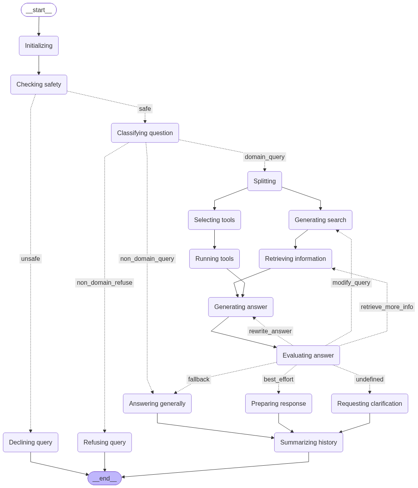

RAG
===

What is RAG?
------------

Retrieval Augmented Generation (RAG) is an AI framework that
retrieves facts from an external knowledge base to ground large
language models (LLMs) on the most accurate, up-to-date information
and to give users insight into LLMs' generative process [Wikipedia]_.

.. [Wikipedia] Retrieval-augmented generation - Wikipedia
   https://en.wikipedia.org/wiki/Retrieval-augmented_generation

In simpler terms: instead of asking the LLM to answer from its
(frozen, possibly outdated) training data alone, you first look up
relevant documents in your own vector store and hand them to the LLM
as context.  The LLM's answer is grounded in those documents, and the
source can be cited -- reducing hallucinations and making the process
transparent.

Why RAG over fine-tuning?
-------------------------

RAG has several advantages over fine-tuning (retraining) a model on
your data:

* **No training cost** -- no GPU needed, no training pipeline.
  RAG works with any LLM out of the box.
* **Incremental** -- add documents any time; no re-training needed.
* **Grounded answers** -- the LLM cites its sources.  Fine-tuned
  models can still hallucinate facts they were trained on.
* **Transparent** -- you control the corpus.  If an answer looks
  wrong, you can inspect the retrieved chunks.
* **Swap models freely** -- change the underlying LLM without
  rebuilding your knowledge base.

Fine-tuning still has its place (teaching a model an entirely new
skill or output format), but for open-ended question answering over a
document collection, RAG is the simpler and more maintainable choice.

Klea's architecture
-------------------

At a high level, a query flows through these stages:

1. **Guard** (optional) -- a safety model (e.g. ``llama-guard3``)
   checks whether the query is safe and appropriate.  Unsafe queries
   are declined immediately.  Set ``KLEA_RAG_GUARD_MODEL`` to an empty
   value to skip this step entirely.

2. **Classify** -- a chat model classifies the query into one of the
   configured *domains* (e.g. "NeuroML documentation"), or routes it
   to general chat, or refuses if no domain matches.

3. **Retrieval** -- the system generates one or more search queries,
   optionally calls MCP tools (for live data), and retrieves the most
   relevant chunks from the matching domain's stores (vector stores
   and/or BM25 keyword stores).  Results from the different stores are
   combined with Reciprocal Rank Fusion (see :ref:`hybrid-retrieval`).

4. **Answer** -- the chat model generates an answer from the
   retrieved context, citing its sources.

5. **Evaluate** -- an evaluator checks the answer's quality.  If it
   is unsatisfactory, the system can loop back to retrieve more
   information, rewrite the query, or regenerate the answer.

6. **Memory** -- conversation history is summarised per session so
   the system can refer to earlier exchanges.

The pipeline is implemented as a `LangGraph
<https://langchain-ai.github.io/langgraph/>`_ state machine, using
the shared :class:`~klea_utils.graph.base.BaseLangGraph`
orchestrator from ``klea_utils``.

   The RAG pipeline visualised as a LangGraph state machine.

Domains and stores
------------------

Domains are the organising unit of Klea RAG:

* A **domain** bundles related knowledge and configuration
  (e.g. "NeuroML documentation", "My project's internal docs").
* Each domain has one or more **stores** containing the chunks:
  **vector stores** (dense embedding similarity) and/or **BM25 keyword
  stores** (classic lexical search).
* The classifier uses the domain's *description* to decide where a
  query should go.
* Domains can also have **MCP servers** attached, giving the LLM
  access to live tools (e.g. a validation server, a database query
  tool).

Each store's ``name`` in the config must exactly match the
``--collection`` name used when the store was created with
``klea-stores-create``, and its ``path`` must match the location the
chunks were written to.  Retrieval looks stores up by name, so a
mismatch silently returns no results.  For local Chroma stores the
``path`` points at the store folder; the database file inside it is
always named ``chroma.sqlite3`` (see
:doc:`../tutorials/create-and-use-rag`).

This means one RAG server can simultaneously serve completely
different knowledge areas -- the classifier routes queries to the
right domain automatically.

.. _hybrid-retrieval:

Hybrid retrieval (vector + BM25)
--------------------------------

Each domain can configure ``vector_stores``, ``bm25_stores``, both, or
neither.  BM25 provides a classic keyword search that complements
dense embedding similarity: exact names, symbols, and terminology that
a semantic search might miss are surfaced by the lexical match.

When a domain configures both, every query runs against all of the
domain's stores and the results are combined with **Reciprocal Rank
Fusion** (RRF): a document is scored by its rank within each store's
result list (``1 / (60 + rank)``), so results from the different stores
are merged without comparing their raw scores (cosine similarity and
BM25 scores are not on the same scale).  Duplicate chunks are removed
and the top ``k`` references are kept.

The original per-source scores are preserved in each document's
``_source_scores`` metadata, so the answer LLM sees e.g. both the
vector-store similarity and the BM25 score, labelled by source.

To create a BM25 store alongside a vector store, pass
``--bm25-store`` to ``klea-stores-create`` (see
:doc:`../tutorials/create-and-use-rag`), then add a ``bm25_stores``
entry to the domain config pointing at the written corpus file.

.. seealso::

   * :doc:`../glossary` -- definitions of key terms
   * :doc:`../tutorials/create-and-use-rag` -- walk through setting up a
     RAG system end to end
   * :doc:`../cli/klea-rag-serve` -- server CLI reference
   * :doc:`../cli/klea-rag` -- client CLI reference (CLI, NiceGUI, Streamlit)
